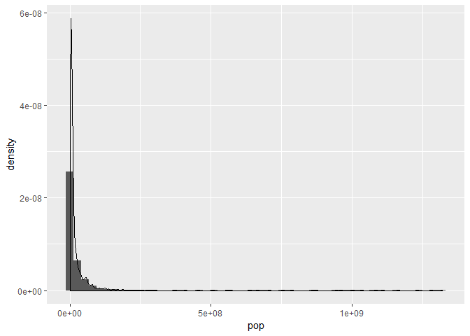

hw02-gapminder
================

### Exploring the gapminder object:

##### Determine type and class of gapminder:

``` r
library("gapminder")
library("tidyverse")
```

    ## -- Attaching packages ------------------------------------------------------------ tidyverse 1.2.1 --

    ## v ggplot2 3.0.0     v purrr   0.2.5
    ## v tibble  1.4.2     v dplyr   0.7.6
    ## v tidyr   0.8.1     v stringr 1.3.1
    ## v readr   1.1.1     v forcats 0.3.0

    ## -- Conflicts --------------------------------------------------------------- tidyverse_conflicts() --
    ## x dplyr::filter() masks stats::filter()
    ## x dplyr::lag()    masks stats::lag()

``` r
library("ggplot2")

typeof(gapminder) # gives a more general result
```

    ## [1] "list"

``` r
class(gapminder)
```

    ## [1] "tbl_df"     "tbl"        "data.frame"

gapminder object is a list of class data frame (data frame columns can be different types)

##### Determine number of rows and columns:

``` r
nrow(gapminder) # number of observations
```

    ## [1] 1704

``` r
ncol(gapminder) # number of variables
```

    ## [1] 6

1704 rows/observations and 6 columns/variables

##### Other ways to determine these:

``` r
str(gapminder)
```

    ## Classes 'tbl_df', 'tbl' and 'data.frame':    1704 obs. of  6 variables:
    ##  $ country  : Factor w/ 142 levels "Afghanistan",..: 1 1 1 1 1 1 1 1 1 1 ...
    ##  $ continent: Factor w/ 5 levels "Africa","Americas",..: 3 3 3 3 3 3 3 3 3 3 ...
    ##  $ year     : int  1952 1957 1962 1967 1972 1977 1982 1987 1992 1997 ...
    ##  $ lifeExp  : num  28.8 30.3 32 34 36.1 ...
    ##  $ pop      : int  8425333 9240934 10267083 11537966 13079460 14880372 12881816 13867957 16317921 22227415 ...
    ##  $ gdpPercap: num  779 821 853 836 740 ...

``` r
dim(gapminder)
```

    ## [1] 1704    6

`str()` gives more information about the object - is useful when want to explore the object in detail; `dim()` gives info about the number of rows and cols together, while `nrow()/ncol()` is useful when want to only look at the number of either one.

##### Data type of each variable:

``` r
str(gapminder)
```

    ## Classes 'tbl_df', 'tbl' and 'data.frame':    1704 obs. of  6 variables:
    ##  $ country  : Factor w/ 142 levels "Afghanistan",..: 1 1 1 1 1 1 1 1 1 1 ...
    ##  $ continent: Factor w/ 5 levels "Africa","Americas",..: 3 3 3 3 3 3 3 3 3 3 ...
    ##  $ year     : int  1952 1957 1962 1967 1972 1977 1982 1987 1992 1997 ...
    ##  $ lifeExp  : num  28.8 30.3 32 34 36.1 ...
    ##  $ pop      : int  8425333 9240934 10267083 11537966 13079460 14880372 12881816 13867957 16317921 22227415 ...
    ##  $ gdpPercap: num  779 821 853 836 740 ...

-   country is a factor
-   continent is a factor
-   year is integer
-   lifeExp is numeric
-   pop is integer
-   gdpPercap is numeric

### Exploring individual variables:

##### Categorical variable:

``` r
levels(gapminder$continent)
```

    ## [1] "Africa"   "Americas" "Asia"     "Europe"   "Oceania"

``` r
summary(gapminder$continent)
```

    ##   Africa Americas     Asia   Europe  Oceania 
    ##      624      300      396      360       24

``` r
ggplot(gapminder, aes(continent, fill = continent)) + # fill parameter allows to colour each bar
  geom_bar()
```


-   gapminder has 5 values in continent variable: Africa, Americas, Asia, Europe, Oceania.
-   The most common level is Africa (found 624 times), the least encountered is Oceania (24 observations).

##### QUantitative variable:

``` r
summary(gapminder$pop)
```

    ##      Min.   1st Qu.    Median      Mean   3rd Qu.      Max. 
    ## 6.001e+04 2.794e+06 7.024e+06 2.960e+07 1.959e+07 1.319e+09

``` r
ggplot(gapminder, aes(pop)) +
  geom_histogram(aes(y=..density..), bins=50) +
  geom_density()
```



The minimum population value is 60000, max - 1.3e9. Median value is 7.024e6.

### Exploring various plot types:

##### Violin plot of life expectancy for each continent during 1980-1990:

``` r
gapminder %>%
  select(continent, lifeExp, year) %>% 
  filter(year >= 1980, 
         year <= 1990) %>% 
  ggplot(aes(continent, lifeExp, colour = continent)) +
  geom_violin() +
  geom_jitter()
```


Note that Oceania has less data points than other continents.

##### Plot of countries in Oceania - determining the trend in population number over the years:

``` r
gapminder %>% 
  select(country, continent, year, pop) %>% 
  filter(continent == "Oceania") %>% 
  ggplot(aes(year, pop, colour = country)) +
  geom_point() +
  scale_y_log10()
```


New Zealand has lower population numbers than Australia; for both countries the population was increasing over the years.

##### Plot of countries in Oceania - gdpPercap over the years:

``` r
gapminder %>% 
  filter(continent == "Oceania") %>% 
  select(country, year, gdpPercap) %>% 
  ggplot(aes(year, gdpPercap, fill = country)) +
  geom_bar(position = "dodge", stat = "identity") 
```


``` r
# position = "dodge" places 2 bars side by side; stat = "identity" means bar height = data value
```

Before ~1970's, gdp per capita betweeen Australia and New Zealand were similar; after that Australia's gdp per capita became higher than that on New Zealand.

##### Plot of population in countries in Europe in the years 1900-2000:

``` r
gapminder %>% 
  filter(year >= 1900,
         year <= 2000,
         continent == "Europe") %>% 
  select(pop, country) %>% 
  ggplot(aes(country, pop)) +
  geom_boxplot(fill = "lightblue") +
  geom_jitter() +
  theme(axis.text.x = element_text(angle = 90, hjust = 1, vjust = 0.5)) # to rotate x-axis text
```


Germany had the biggest population in 20th century compared to other European countries.

##### Plot of population in 2002 vs 2007:

``` r
gapminder %>% 
  filter(year == "2002" | year == "2007") %>% 
  select(continent, pop, year) %>% 
  ggplot(aes(as.factor(year), pop, shape = continent)) +
  geom_jitter() +
  scale_y_log10() +
  xlab("year")
```


